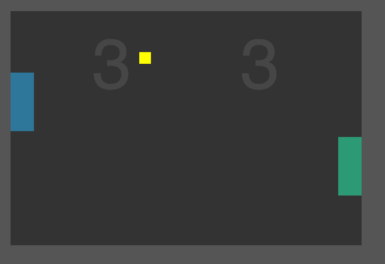

# Teach with Games

We want to teach JavaScript using some kind of visual feedback to assist the
learning process.  To this end, learning programming concepts by making simple
games may offer an engaging environment.

Some sample code and curriculum ideas:

## [Tic Tac Toe](tic-tac-toe)

## [Pong](pong)

