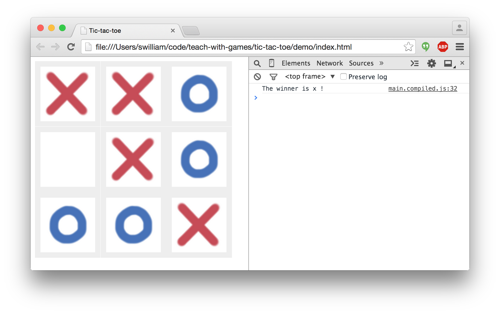

# Tic-tac-toe Demo



1. To allow simple destructuring assignment syntax, we use `babel`:

    ```
    $ npm install --global babel
    $ babel main.js --watch --out-file main.compiled.js
    ```

1. Open `index.html`

